

    <h1>灵活, 小巧, 可靠</h1>

    <h2>RM2024香港科技大学ENTERPRIZE</h2>

    <h1>G4主控板硬件开源</h1>

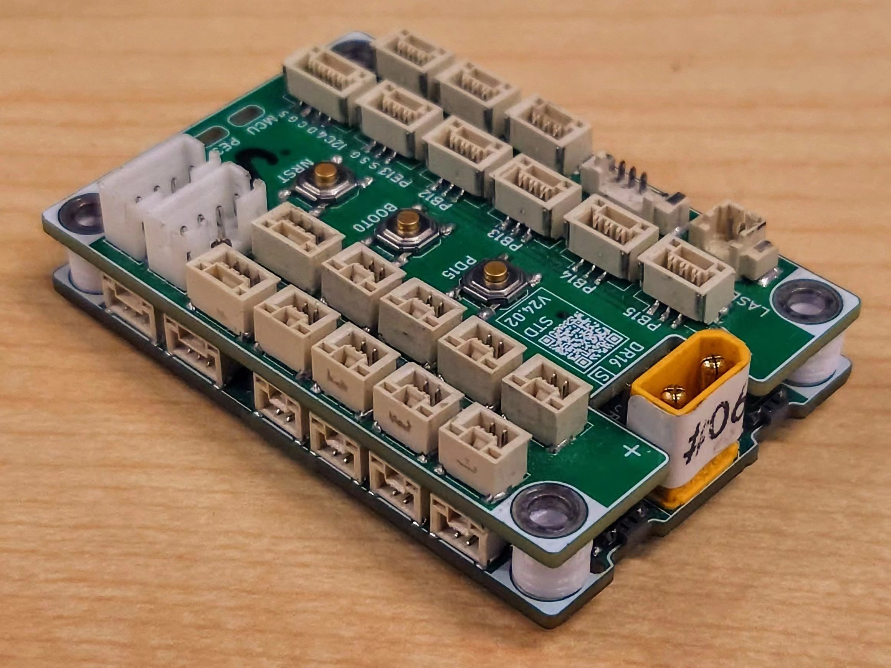
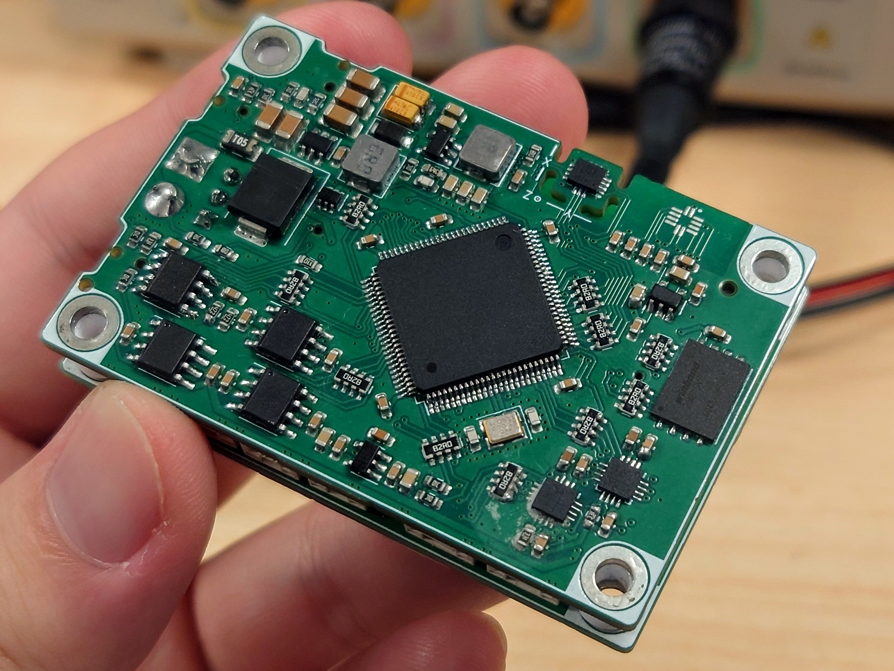

> 设计者：xzm/贤梓铭 zxianaa@connect.ust.hk
>
> 指导/提议：jyc, jason chan, ry, ofr, fallengold, zzy
>
> 香港科技大学ENTERPRIZE战队 robomasterhkust@gmail.com

## 开源内容

~~~
RM2024_MainControlBoard
├── RM2024_G473_MCB             >核心板工程文件
├── RM2024_G473_MCB_StdExtend   >常规扩展板工程文件
├── RM2024_G473_MCB_EngExtend   >单板方案工程扩展板工程文件 by ofr
├── RM2024_G473_MCB_Debugger    >调试小板工程文件
├── RM2024_G473_MCB_Shim.step   >一体3D打印垫片step文件 by tsl
├── PDF Schematic               >PDF格式的原理图
├── Fabrication Files           >生产文件(包括SMT)
├── image
└── README.md
~~~

开源工程文件设计软件为KiCAD 7.0, 建议使用KiCAD 8.0打开, 可以导入立创EDA

生产文件使用KiCAD插件 "Fabrication Toolkit" 生成

工程文件中包含 kicad_pro(工程); kicad_pcb(PCB); kicad_sch(原理图); ibom(焊接小工具, 由 "Interactive HTML BOM" 插件生成)

## 方案简介

整套主控板分为核心板(下板)和扩展板(上板), 两板之间使用80pin BTB接口连接; 核心板包含所有核心芯片, 而扩展板一般只用于引出接口 (以及buzzer, laser等功能), 需要特殊功能时则用作功能扩展

- MCU: STM32G473VET6
- IMU: ICM-42688P
- 磁力计: LIS3MDLTR
- TTL (硬件流控): CH343P *2 
- FDCAN *3
- RS485 (硬件流控) *1
- FLASH: W25N01GVZEIG

## 项目背景 & 应用情况

在 RoboMaster 2024 赛季, 由于队内自研的上一代主控板 (F407) 已经无法满足对机器人控制的需求, 于是产生了设计新型主控板的需求

在经过反复考虑和对比后, 我们选择了STM32G473VET6作为主控芯片, 主要原因如下

- 共有三路FDCAN外设, 可以控制更多电机
- 支持RS485硬件流控功能, 提升板间通讯的稳定性
- 相较于H7系列复杂度较低, 开发难度与F4系列近似

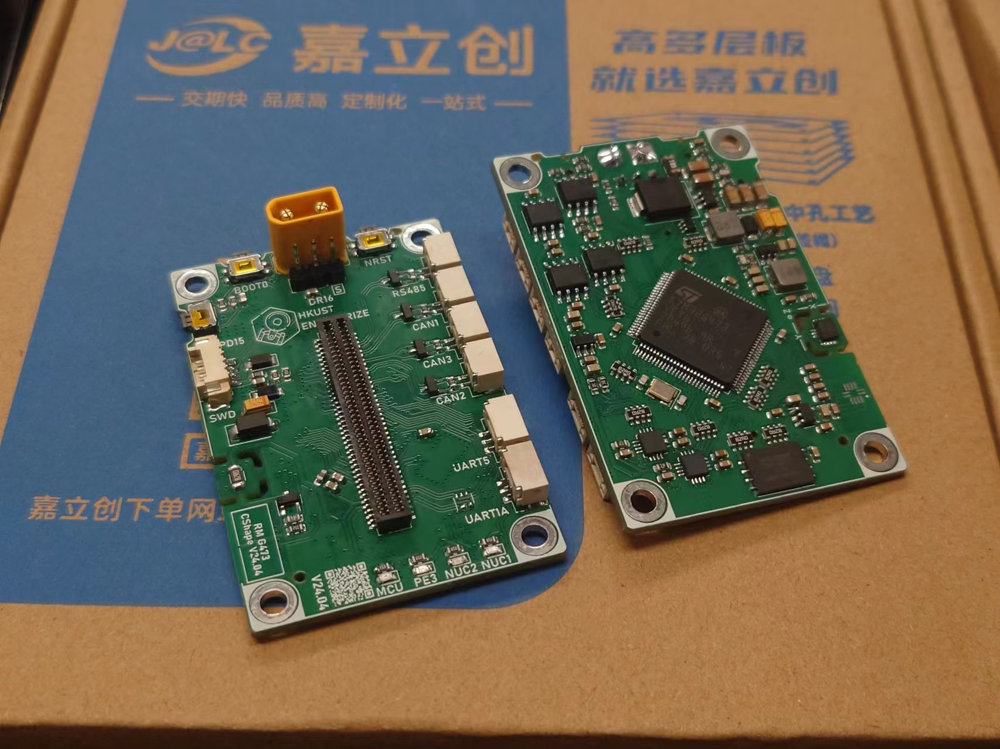

同时, 新一代主控板也有缩小体积的需求, 整个主控板大小控制在 60×40×21mm, 与大疆C板相近, 便于机械安装

最终, G4主控板被应用于ENTERPRIZE战队本赛季所有新研发的机器人, 并且实现了工程机器人的单板方案

## 硬件连接框图(简化)

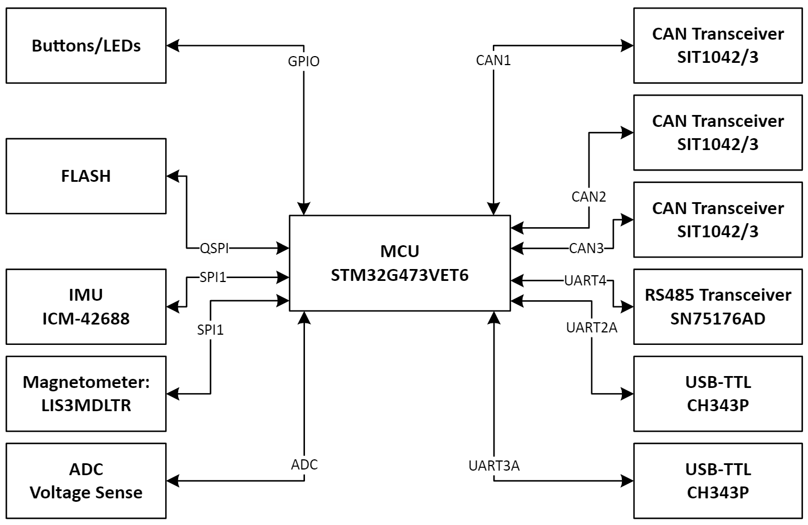

## 技术细节

### UART

虽然STM32G473的FDCAN等外设数量较多, 但UART的数量却只有5个, 如果用传统的方法对UART和相应功能进行一一绑定, 那么UART数量则不足以实现所有需要的功能

为了解决此问题, G4主控板在设计时利用了MCU外设内部的MUX, 比如 UART1 可以配置为 PC4/PC5 或 PE0/PE1, 再与相应功能进行绑定, 以此来实现在不同应用场景中适应不同需求的能力

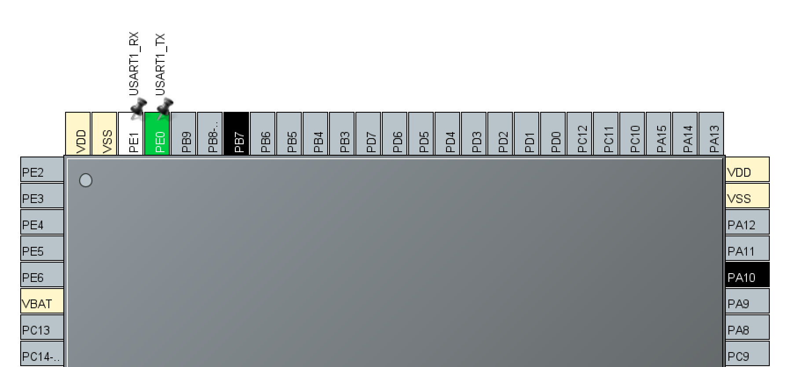

同时, 对于同一功能, G4主控板也提供了可以从多个外设的访问的选项; 比如对于接收机, 可以通过软件配置来使用 UART1 或 UART3 来接受数据

下面是具体的UART引脚配置, 以A/B/C后缀来表示同一UART的不同配置方式:

|        | TX   | RX   | DE   | CTS  | RTS  | 功能          |
| -----  | ---- | ---- | ---- | ---- | ---- | ----          |
| UART1A | PC4  | PC5  | -    | -    | -    | 裁判系统/图传  |
| UART1B | PE0  | PE1  | -    | -    | -    | 通用          |
| UART1C | -    | PA10 | -    | -    | -    | 接收机        |
| UART2A | PA2  | PA3  | -    | PA0  | PA1  | TTL1          |
| UART2B | PD5  | PD6  | -    | -    | -    | 通用          |  
| UART3A | PD8  | PD9  | -    | PD11 | PD12 | TTL2          |
| UART3B | PB10 | PE15 | -    | -    | -    | 通用          |  
| UART3C | -    | PB11 | -    | -    | -    | 接收机        | 
| UART4  | PC10 | PC11 | PA15 | -    | -    | RS485        |   
| UART5  | PC12 | PD2  | -    | -    | -    | 裁判系统/图传 |

下面是部分机器人上的UART功能分配

|                   | UART1 | UART2 | UART3 | UART4 | UART5 |
| -----             | ----  | ----  | ----  | ----  | ----  |
| 步兵云台 | [C] 接收机 | [A] TTL1 | RESV | RS485 | [A] 图传 |
| 英雄云台 | [C] 接收机 | [A] TTL1 | RESV | RS485 | [A] 图传 |
| 哨兵云台 | [C] 接收机 | [A] TTL1 | [A] TTL2 | RS485 | [A] 图传 |
| 工程(单板) | [A] 裁判系统 | [B] 总线舵机  |  [C] 接收机 | RS485 | [A] 图传|
| 通用底盘  | RESV | RESV | RESV | RS485 | 裁判系统 |

### IMU

经过对比测试, IMU选择ICM-42688P, 并配合加热电阻实现恒温

经过测试, 选用1206封装, 36ohm的电阻可以满足恒温50°C的需求; 经测试, 恒温后纯IMU姿态解算5分钟内漂移小于1°

同时, SPI信号线串接82ohm电阻, 通信速率可以稳定20M

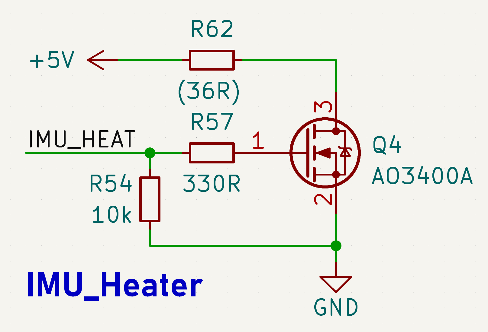

### RS485

|       | TX/D | RX/R | DE   |
| ----- | ---- | ---- | ---- |
| RS485 | PC10 | PC11 | PA15 |

主控板集成RS485来提供板间通信功能, 相较于串口, RS485可以使通信更加稳定(特别是过滑环时)

RS485 Transceiver选用SN75176AD, 可替换为其他芯片; 用SM712进行保护

使用STM32G473的RS485硬件流控功能后, 板间通信速率最高可以达到4.8M, 丢包率小于0.09%

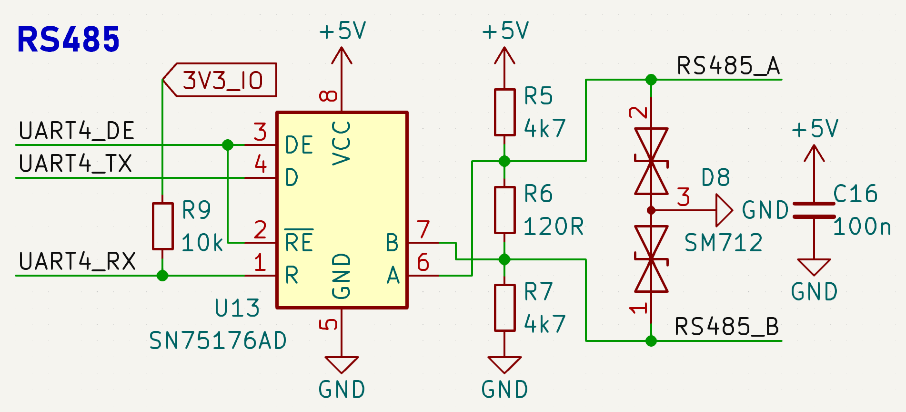

### CAN (×3)

|       | TX   | RX   |
| ----- | ---- | ---- |
| CAN1  | PD1  | PD0  |
| CAN2  | PB6  | PB5  |
| CAN3  | PB4  | PB3  |

CAN Transceiver选用SIT1042T/3, 可替换为其他芯片; 使用ESD1CAN进行保护

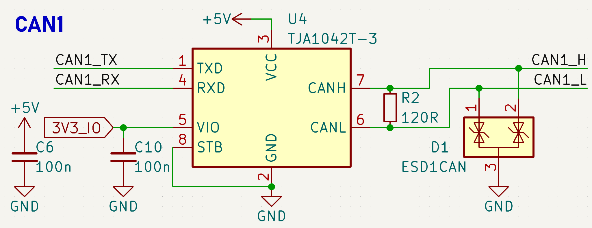

### USB-TTL (×2)

|       | TX   | RX   | CTS  | RTS  |
| ----- | ---- | ---- | ---- | ---- |
| TTL1 (UART2A)  | PA2  | PA3  | PA0  | PA1  |
| TTL2 (UART3A)  | PD8  | PD9  | PD11 | PD12 |

USB-TTL选用CH343P, 连接了RTS/CTS引脚来实现硬件流控, 使用TPD4E1U06DCKR进行保护

经测试全双工条件下单向速率稳定2M, 实测丢包率0.006%左右

连接了ACT指示灯, 方便观察连接状态, 此功能上场时非常有用(观察MiniPC是否断连)

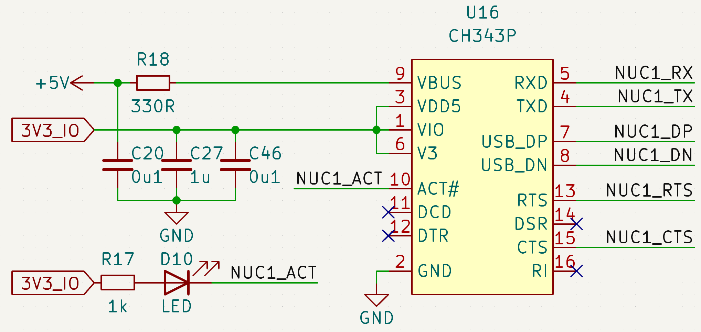

### FLASH

|       | NCS   | CLK   | IO0  | IO1  | IO2  | IO3  |
| ----- | ---- | ---- | ---- | ---- | ---- | ---- |
| MCU   | PD3  | PF10  | PD4  | PC2  | PD3  | PC7  |

主控板集成FLASH用于记录数据, 便于调试分析; 型号选用W25N01GVZEIG; 通过QSPI与MCU进行通信

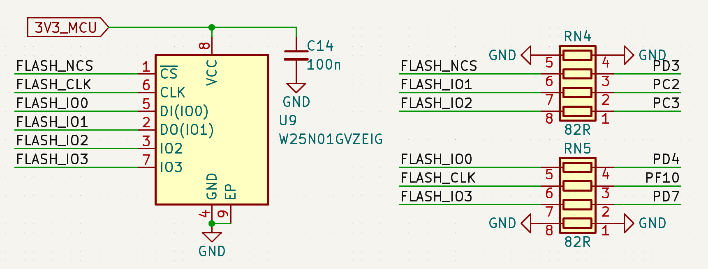

### 接收机

G4主控板采用MCU内部反相, 无需外部反相电路, 使用TPD4E1U06DCKR进行保护

可以通过 PB11(UART3) 或 PA10(UART1) 接收信号, 防止其中一个串口被占用的情况

### 硬件ID检测

通过短接扩展板上的三个ID焊盘, 可以配置主控板的 ID 和 Master/Slave角色

通过在代码中加入ID验证步骤, 可以防止因烧错代码导致 RS485 Transceiver 烧毁等问题

## 供电系统

### 电源框图

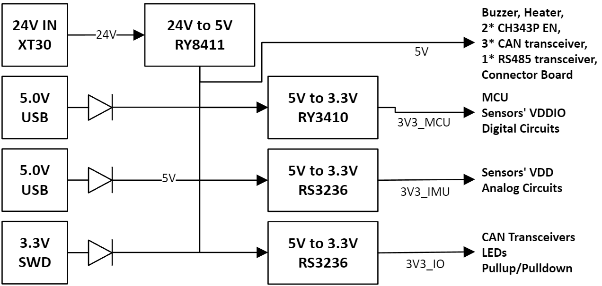

### 设计细节及原因

#### 3V3_MCU

由Buck电路而非LDO降压产生, 原因是STM32G473耗电量较大, 使用LDO会有潜在的过热问题; 

同时, 主控板上没有高精度ADC的需求, 故Buck电路的纹波对主控板正常工作影响不大

#### 3V3_IMU

专门用于IMU和磁力计的 VDD 供电网络, 防止其他噪声干扰IMU和磁力计; 

注意IMU和磁力计的 VDDIO 由 3V3_MCU 提供, 防止芯片内部通信部分对电源产生潜在干扰

#### 3V3_IO

主要用于于外部直接产生交互的外设的VIO;

与 3V3_MCU 隔离, 主要原因是为了防止外部收发信号时对核心供电的干扰, 比如 CAN 和 TTL 都直接使用 3V3_IO 作为生成信号电平的电源

#### 3V3_SWD

队内发生过因烧录器LDO损坏而导致5V烧毁MCU, 因此与 3V3_MCU 隔离, 通过二极管接入5V网络并同时防止倒灌;

此设计也产生了一个缺陷: 当主控板仅由烧录器供电是, 有时会因为压降太大而导致烧录不正常, 因此建议在有MiniPC USB供电或24V供电的情况下进行代码烧录和调试

#### 电压采样

主控板对 24V 和 5V 电源网络进行了电压采样;

前者是为了监测24V真实电源电压, 可以得到一些粗略电压信息;

后者是通过检测微小电压差异来确定目前的供电方式 (利用Buck输出 5.2V, USB供电 5.0V, SWD供电三种情况导致的差异), 并且在状态不正常时报警 (比如可以检测24V转5V的Buck损坏)

### 纹波测试
5V

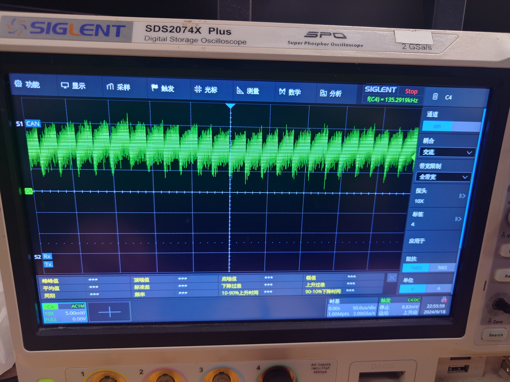

3V3_MCU

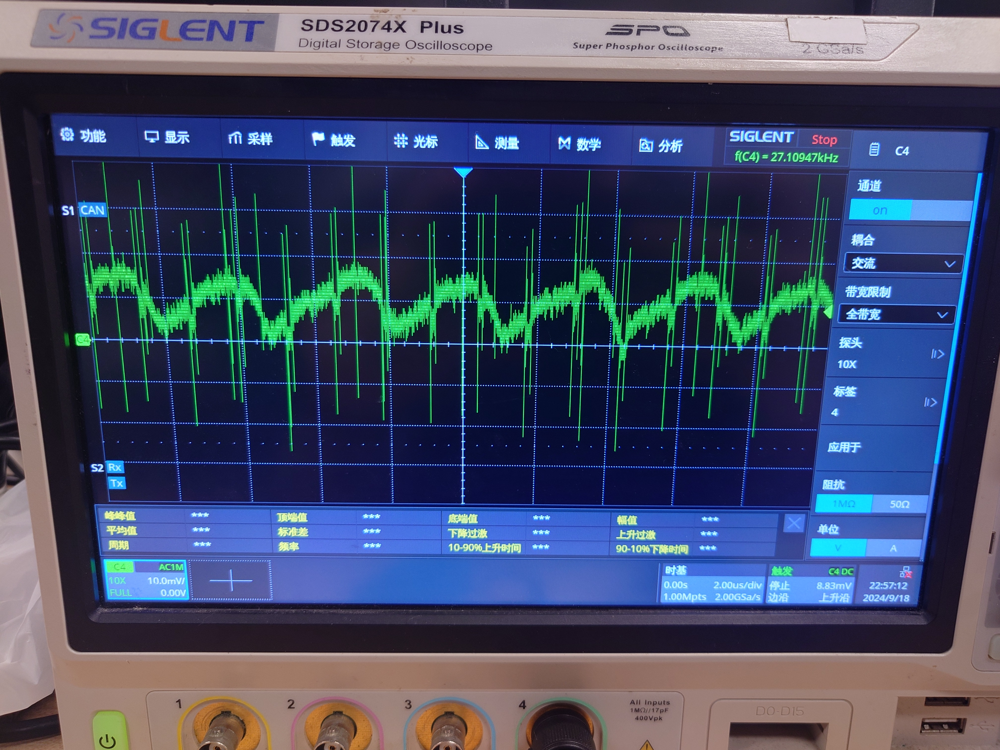

## 复刻注意事项

- 目前包含的SMT生产文件格式适用于嘉立创, 如有需要请重新生成
- BTB很脆弱, 避免在不垫垫片的情况下安装
- 焊接IMU后不要用超声波洗板
- 如有任何问题, 欢迎联系 zxianaa@connect.ust.hk; wx: xianziming0531
